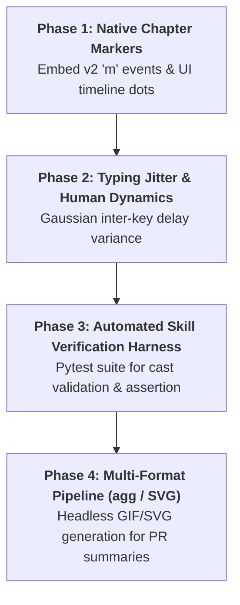

# Experiment Roadmap & Validation Plan

A structured roadmap for iteratively experimenting with and advancing the terminal walkthrough toolkit.

---

## 🗺️ Experiment Roadmap

---

### Phase 1: Native Chapter Markers & Step Scrubbing
- **Objective**: Automatically emit Asciicast v2 marker events (`[timestamp, "m", "Step Name"]`) whenever `rec.add_marker(...)` or `rec.send_turn(...)` is called.
- **Player Integration**: Configure `asciinema-player` to read markers and enable `[` / `]` keyboard navigation.
- **Success Criteria**: Web player displays visible chapter markers on the timeline scrubber that jump directly to each step banner.

---

### Phase 2: Natural Typing Dynamics (Gaussian Jitter)
- **Objective**: Replace static `char_delay=0.035` with a randomized Gaussian distribution ($30\text{ms} \pm 8\text{ms}$) with slightly longer pauses before spaces and punctuation.
- **Success Criteria**: Visual terminal output looks indistinguishable from an experienced software engineer typing at a local workstation.

---

### Phase 3: Automated Skill Verification & Testing Suite
- **Objective**: Provide a built-in automated test harness (`tests/test_pty_recorder.py`) that tests the recorder engine, time-clamping math, secret redaction, and schema validity without external dependencies.
- **Success Criteria**: 100% passing unit tests in $< 2$ seconds.

---

### Phase 4: Headless Asset Generation (GIF / Static Previews)
- **Objective**: Provide an optional rendering step (via `agg` or headless Playwright) to convert `.cast` files into lightweight animated GIFs for embedding directly into Markdown files and PR descriptions.
- **Success Criteria**: Single command `python3 scripts/export_gif.py demo.cast demo.gif` producing an optimized GIF under 5MB.
