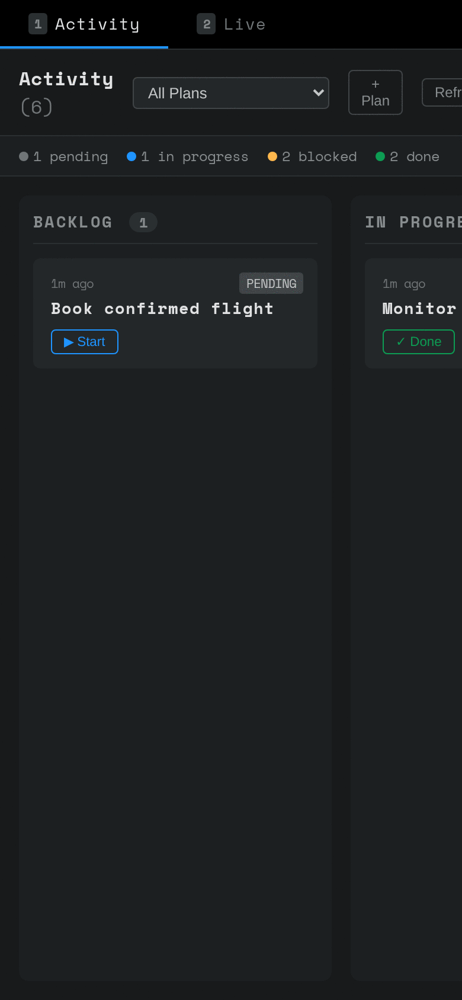

# Critical User Journeys (CUJs)

Visual documentation of key user flows.

---

## CUJ 1: App Tour

**Goal:** Navigate the main app layout.

**Steps:**
1. Open app → Activity tab with Kanban board
2. View task cards in different states
3. Switch to Live tab (voice/video controls)
4. Return to Activity tab

---

## CUJ 2: Create Task

**Goal:** Create a new plan and task.

**Steps:**
1. Click "+ Plan" button
2. Enter plan name, click Add
3. Click "+ Task" button
4. Enter task name, click Add
5. See new task in Backlog

---

## CUJ 3: Move Task

**Goal:** Progress a task through workflow states.

**Steps:**
1. Find task in Backlog with "Start" button
2. Click Start → moves to In Progress
3. See Done/Failed action buttons
4. Click Done → moves to Done column

---

## Technical Details

- **Viewport:** 390x844 (iPhone 12 Pro)
- **Scale:** 2x for retina
- **Tool:** Playwright + Chromium headless
- **GIF creation:** ImageMagick `convert -delay 150 -loop 0`

---

*Generated with [cuj-screenshots](https://github.com/zeroasterisk/cuj-screenshots)*
